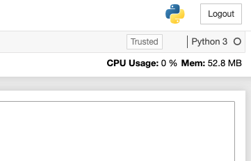

```
       _
 _ __ | |__  _ __  _ __ ___   ___ _   _ ___  __ _  __ _  ___
| '_ \| '_ \| '_ \| '__/ _ \ / __| | | / __|/ _` |/ _` |/ _ \
| | | | |_) | |_) | | | (_) | (__| |_| \__ \ (_| | (_| |  __/
|_| |_|_.__/| .__/|_|  \___/ \___|\__,_|___/\__,_|\__, |\___|
            |_|                                   |___/
```

### Introduction
-----
Jupyter notebook extension to overview the process usage of running notebook using psutil.
This project is inspired from [nbresuse](http://github.com/yuvipanda/nbresuse/).

**Preview**


---

**nbprocusage:**

- nb as in - notebook
- proc as in - process
- usage as in - cpu and memory usage of the running process

---

### Installation
- `$ pip install -i https://test.pypi.org/simple/ nbprocusage`
- `$ jupyter serverextension enable --py nbprocusage --user`
- `$ jupyter nbextension install --py nbprocusage --user`
- `$ jupyter nbextension enable --py nbprocusage --user`

---

### Similar Projects
- [nbresuse](http://github.com/yuvipanda/nbresuse/)

---
### License

[](http://badges.mit-license.org)

- **[MIT license](http://opensource.org/licenses/mit-license.php)**